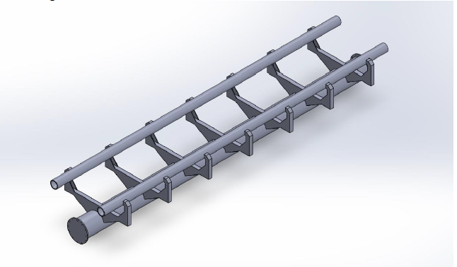
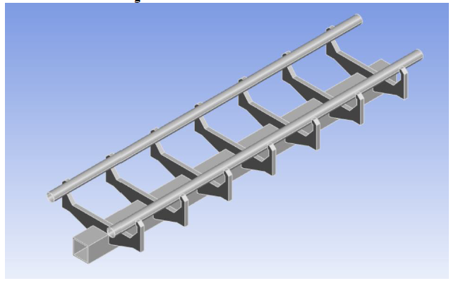
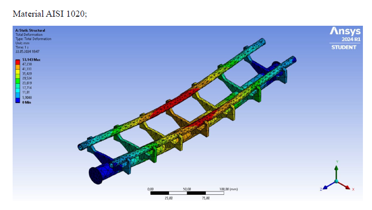
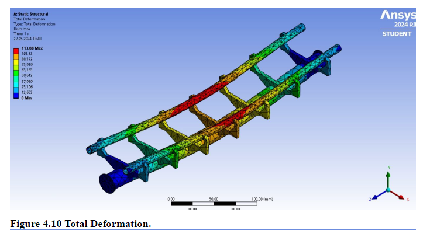

# Structural_Analysis_of_Roller_Coaster_Rails
This project investigates roller coaster rail designs using Finite Element Analysis via ANSYS and experimental optimization through the Taguchi Method. The goal is to identify the most structurally efficient rail configuration under different load scenarios

---

## 🛠 Tools Used

- **ANSYS Workbench** for structural simulations
- **Taguchi Method** for design of experiments (DOE)
- **SolidWorks**  for CAD modeling

---

## 📐 Rail Design Geometries

### 🧪 First Design
  
*Standard geometry with uniform curvature.*

### 🧪 Second Design
  
*Modified curvature to reduce deformation.*

### 🧪 Third Design
  
*Optimized for structural strength and aesthetic.*

---

## 📊 Stress & Deformation Results

### ✅ Best Case – Third Design (AISI 1020, 70 MPa)
  
*Minimal deformation and stress levels.*

### ❗ Worst Case – Third Design (AISI 1020, 150 MPa)
  
*Rail integrity remains intact under maximum load.*

---

## 🧬 Optimization Method

- **Design Parameters**: Rail shape, angle, and material  
- **Materials Tested**: AISI 1018, 1019, 1020  
- **Optimization Goal**: Minimize total deformation  
- **S/N Ratio Analysis**: "Smaller-the-Better" approach  
- **Best Result**: Test #7 – Third Design with AISI 1020

---

## 📄 Full Report

You can access the complete project documentation here:

[📥 Click to view the full report (PDF)](structural_analysis.pdf)

---

## 📁 Project Structure

```bash
├── README.md─
│   ├── first_design.png
│   ├── second_design.png
│   ├── third_design.png
│   ├── third_best_aisi1020.png
│   └── third_worst_aisi1020.png
│   └── structural_analysis.pdf
